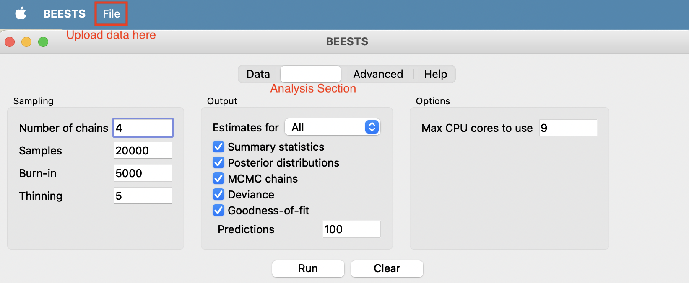
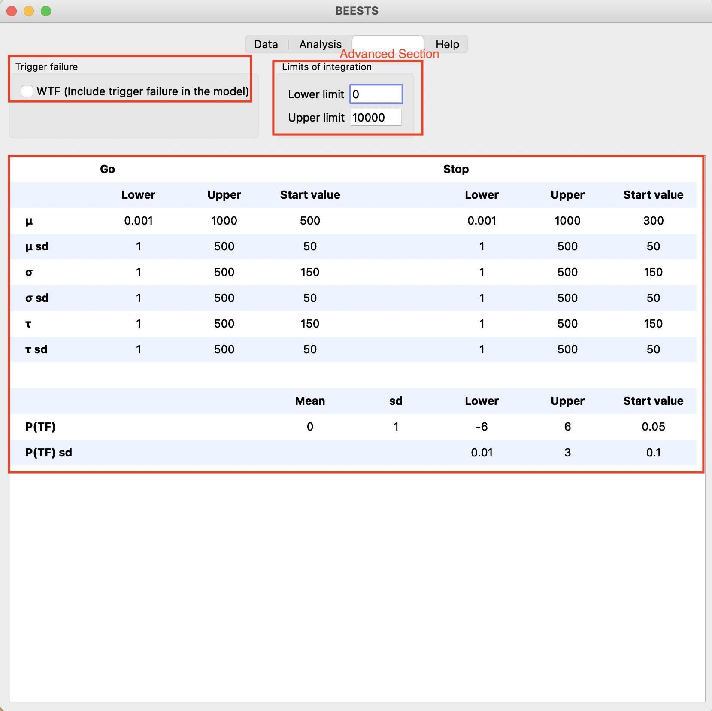

# Stop_Signal_Model_Fitting

This repository serves as the testing base for implementing the [**stop signal respond task**](https://cambridgecognition.com/stop-signal-task-sst/) in the [`pymc`](https://www.pymc.io/welcome.html) ecosystem, before incorporating into the [`hssm`](https://lnccbrown.github.io/HSSM/) architecture (also built upon `pymc`).

This project is in collaboration with Michael J. Frank and Alex Fengler from Brown University.

## Requirements
It is recommended to run the code on the local machine by setting up a virtual environment (e.g., [venv](https://docs.python.org/3/library/venv.html) or [conda](https://uoa-eresearch.github.io/eresearch-cookbook/recipe/2014/11/20/conda/)). For example, you can create the virtual `venv`
environment named **venv**:
```bash
# Create the virtual environment:
python3.11 -m venv venv

# Activate the virtual environment:
source venv/bin/activate
```

Then, download the required packages:
```bash
pip install -r requirements.txt
```

The [requirements.txt](requirements.txt) is generated using: 
```bash
pip freeze
```

## Stop Signal Task
As a classifical experimental paradigm to measure impulse control, the experimental design of the stop signal task (for model fitting) follows the one proposed by Frederick Verbruggen (charactrized by 25% of stop trials and staircase ssd). For more details, please refer to [his jspsych implementation of this task](https://github.com/fredvbrug/STOP-IT/tree/master/jsPsych_version). 

## (Top-Level) Repository Structure
    .
    ├── BEESTS/               # a GUI software for model fitting on stop signal task
    ├── data_for_paper/       # real data for model fitting
    ├── model_fitting/        # hierarchical and individual level model fitting
    ├── simulation/           # (forward) simulator of stop signal test
    ├── .gitignore
    ├── README.md
    └── requirementd.txt   

### `BEESTS` directory
BEESTS (use this [link](https://osf.io/482fv/) to download the software) is a GUI-based package enabling Bayesian hierarchical estimation of response time models for the stop signal task ([Matzke et al., 2013](https://doi.org/10.3389/fpsyg.2013.00918)). In this repository, it mainly serves to perform sanity check (also help debugging) for our own pymc model. 

In order to run it smoothly on your local machine after downloading the software, it is important to check (oftentimes overwrite) the currernt permission to run this software. For instance, for mac users:
```bash
# Allow software downloading from anywhere (replace `disable` into `enable` after if you do not want to always allow your computer to download anything)
sudo spctl --master-disable

# Grant permission
sudo chmod -R 755 <path to software>
```

We also included [convert_format.py](BEESTS/convert_format.py) file that helps convert data format from the one our pymc model expects to the one BEESTS expects. 

#### Fitting data using BEESTS
One thing we did is to fit data (simulated or real) using BEESTS, which not only serves as a sanity check to validate our model fitting results using pymc, but also helps us potential issues with integration while defining the likelihood in sucessful inhibition trials. 

After converting the format to the one BEESTS expects, open **File** section on the top left to upload the data the BEESTS software, and then click **Run** under the **Analysis** section. It will create a directory at the same level of where the data is located, including what analysis is performed under the hood (under `analysis.txt`), deviance statistics and estimated parameter values (`.csv` files), and database (`.db` files). 


One thing to notice is that under the **Advanced** section, users can specify whether they want to include trigger failure in the model, alongside prior settings for all parameters and upper and lower bounds of integration.


Due to the mismatch of `libRblas.dylib` file with my mac operation system (silicon vs. intel-based mac), I adapted the [analysis script](BEESTS/analysis.R), which should originally be called to run after clicking **Run** under the **Analysis** section. Users can now run:
```bash
cd BEESTS

Rscript analysis.R <path_to_analysisDir> <summary_statistics> <posterior_distributions> <mcmc_chains> <posterior_predictors>
# E.g., Rscript analysis.R real_data/real_data.csv_241016-090124 TRUE TRUE TRUE TRUE

cd .
```
The results will be saved in `output.pdf file` under the <path_to_analysisDir>. 

### `model_fitting` directory
1. [model_fitting_simple_test_hierarchical_no_p_tf.ipynb](model_fitting/model_fitting_simple_test_hierarchical_no_p_tf.ipynb): fit a small sample of participants (with varied trials per participant) without *p_tf* at the hierarchical level
2. [model_fitting_simple_test_hierarchical.ipynb](model_fitting/model_fitting_simple_test_hierarchical.ipynb): fit a small sample of participants (with varied trials per participant) at the hierarchical level
3. [model_fitting_simple_test_individual.ipynb](model_fitting/model_fitting_simple_test_individual.ipynb): fit a small sample of participants (with varied trials per participant) at the individual level (both with and without *p_tf*) and test how varying stop parameters and number of trials affect posterior distributions. 
4. [random.py](model_fitting/random.ipynb): some debugging tries on examining the influences of varying parameters (used in formward simulation) on the posterior distribution of parameters.
5. [test_custom_likelihood_archived.ipynb](model_fitting/test_custom_likelihood_archived.ipynb): archived notebook test whether likelihood defintion in [util_archived.py](model_fitting/util_archived.py) is correct. 
6. [util_archived.py](model_fitting/util_archived.py): archived utility functions used in model fitting notebooks (likelihood defined using `PyTensor Op`). 
7. [util.py](model_fitting/util.py): utility functions used in model fitting notebooks, including likelihood defintion for different trial types and posterior predictive sampling (check). 

### `simulation` directory
1. [sanity_check.ipynb](simulation/sanity_check.ipynb): sanity check of (forward) simulator
2. [simulate_hierarchical_pymc.py](simulation/simulate_hierarchical_pymc.py): simulate data for hierarchical-level model fitting (with group/hyper parameters)
3. [simulate_individual_pymc.py](simulation/simulate_individual_pymc.py): simulate data for individual-level model fitting (without group/hyper parameters)
4. [util.py](simulation/util.py): utility functions for forward simulator, including generating a random value following Ex-Gaussian distribution and simulating one synthetic experiment round of trials for a subject (for fixed and staircase ssd).

## Google Drive
A Google Drive folder has been created to store saved traces and saved trials for posterior predictive check. To download them to the local directory: 
```bash
cd model_fitting

# Download saved traces
gdown --no-check-certificate --folder https://drive.google.com/drive/u/0/folders/1Mgy8nQKrI3nMAhqskP0pfwt6dCyDWDoJ?ths=true

# Download saved trials
gdown --no-check-certificate --folder https://drive.google.com/drive/u/0/folders/1iHmZUOqJilN5Xudgk6qY-NVhwykKvk3w?ths=true

cd ..
```
